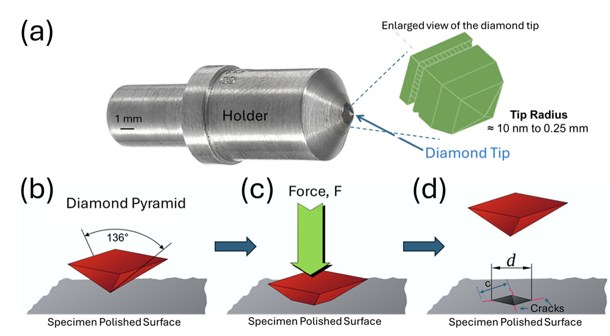

### Specimen Preparation
Prepare a flat ceramic sample and polish the surface sequentially using finer abrasives followed by diamond paste polishing to obtain a mirror-like finish.

### Indentation Loading
Apply a controlled indentation load P ≈ 10 N with a dwell time of ~10 s.

### Indent Selection
Produce multiple indents at well-spaced locations and select only those impressions showing clear radial cracks.

### Crack Measurement
Measure crack length c from the center of the indent to each crack tip and calculate the average.

### Property Inputs
Obtain E and H from indentation measurements or literature.

### Fracture Toughness Calculation
Substitute values into the Anstis equation.

### Repeatability Check
Perform at least 5–10 indentations and report mean KIC with standard deviation.

**Figure 1:** (a) Pyramidal diamond tip Vickers indenter. (b), (c), and (d) show a schematic representation of the indentation process and cracks developed. The measurement of cracks is done using the optical/electron microscope.

---

## Essential Experimental Setup
1. Vickers hardness tester – applies controlled load using a diamond pyramidal indenter
2. Load control and dwell system – ensures reproducible loading/unloading conditions
3. Polished specimen stage – provides a smooth, flat surface for symmetric crack formation
5. Optical / SEM microscope – measures indentation diagonals and crack lengths accurately
6. Data analysis system – computes hardness H and fracture toughness KIC

